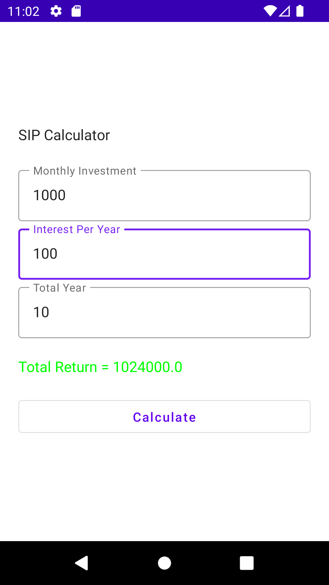

# GDSC_Compose_Camp_Day_3
Create a simple SIP Calculator using Jetpack Compose. Compose Camp Day 3

SIP Calculator use to calculate how much amount you will get after investing some amount on monthly basis with the enter interest rate. 
  

    ./gradlew <tasks-and-options>
